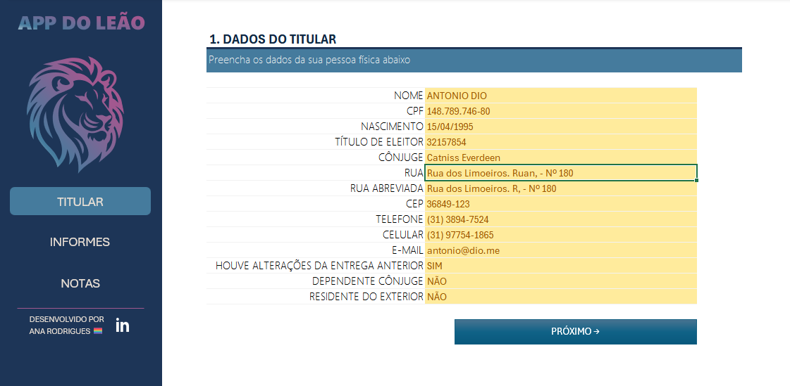

# organizador-ir
> Planilha interativa em Excel para organizar e validar dados da Declaração de Imposto de Renda, com menus de navegação, validações automáticas e uma interface intuitiva. Ideal para centralizar suas informações fiscais de forma prática e eficiente.



# 💰 Organizador de Declaração de Imposto de Renda

Uma planilha interativa no Excel criada para ajudar no controle e organização das informações necessárias para a declaração anual de imposto de renda. Com uma interface intuitiva, funcionalidades automatizadas e navegação simplificada, essa ferramenta visa reduzir erros e otimizar o preenchimento dos dados fiscais.

---

## 📌 Objetivo

Desenvolver uma planilha inteligente e prática no Excel com:

- Validações automáticas para evitar inconsistências  
- Menus de navegação entre seções  
- Campos interativos e estruturados  
- Organização clara dos dados tributáveis  

---

## 🎯 O que você vai encontrar

| Funcionalidade         | Descrição                                                                 |
|------------------------|---------------------------------------------------------------------------|
| ✅ Validação de Dados   | Evita preenchimentos incorretos com regras personalizadas                |
| 📂 Seções Organizadas   | Páginas separadas para titular, informmes e notas                        |
| 🔄 Links Internos       | Botões de navegação para fácil transição entre páginas                  |

---

## 🧭 Como Usar

1. Faça o download ou clone o repositório:
   ```bash
   git clone https://github.com/seu-usuario/organizador-ir.git
2. Abra o arquivo `organizador_declaracao_ir.xlsx` no Excel
3. Habilite macros (se solicitado)
4. Navegue pelas abas utilizando os botões e preencha as informações

## 📁 Estrutura

A organização do repositório segue a estrutura abaixo:

```
organizador-ir/
├── README.md
├── organizador_declaracao_ir.xlsx
├── LICENSE
└── images/
    ├── menu_principal.png
    └── logo_leao.svg

```

- **README.md:** Este arquivo de documentação.
- **perguntas_negocio.txt:** Arquivo com perguntas de negócio consideradas para criação da ferramenta.
- **organizador_declaracao_ir.xlsx:** A planilha com a ferramenta organizadora de imposto de renda.
- **/images:** Pasta destinada a armazenar capturas de tela, diagramas e demais recursos visuais que comprovem o funcionamento e a organização do projeto.

## 🤝 Contribuições
Contribuições são bem-vindas!
1. Faça um fork do projeto
2. Crie sua branch: `git checkout -b nova-funcionalidade`
3. Commit: `git commit -m "Adiciona nova funcionalidade"`
4. Push: `git push origin nova-funcionalidade`
5. Crie um Pull Request

## 📞 Contato

Para mais informações, dúvidas ou sugestões, você pode entrar em contato por meio dos seguintes canais:

- **GitHub:** [anapcrodrigues](https://github.com/anapcrodrigues)
- **E-mail:** anapaulacrodrigues@gmail.com

---

*Desenvolvido por Ana Paula Costa Rodrigues @ 2025-06*

---
